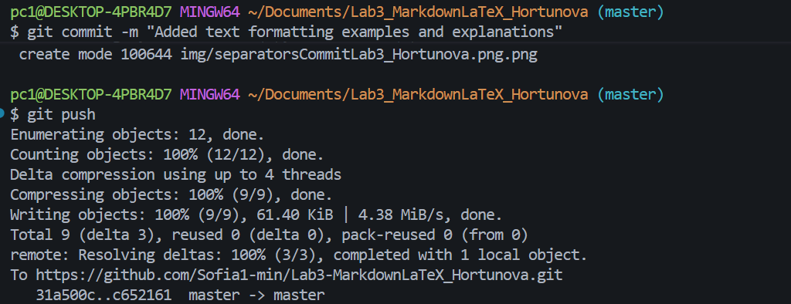
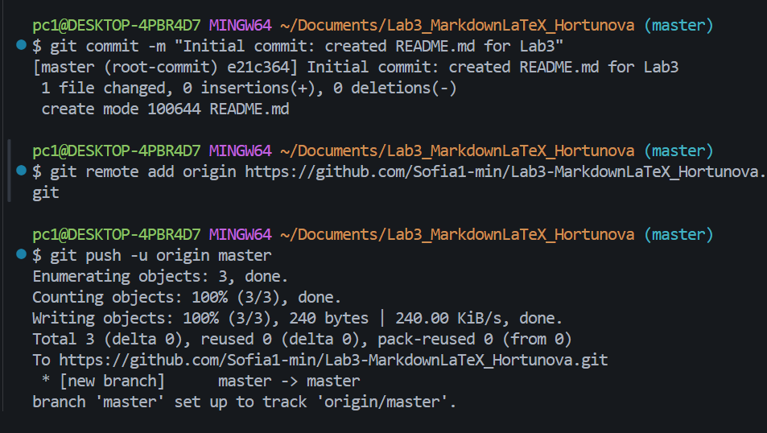

[GitHub](https://github.com/Sofia1-min/Lab3-MarkdownLaTeX_Hortunova/blob/master/docs/ReadmePushLab3_Hortunova.md)

[Markdown](https://www.markdownguide.org/ "Перейти на официальный сайт")

[картинка](https://avatars.mds.yandex.net/i?id=3cf151c686f3b23bbfa54910661ba614_l-5314480-images-thumbs&n=13)
[картинка](https://avatars.mds.yandex.net/i?id=ab3e26103090e0c267cfcdc1d9ab64c5_l-16322001-images-thumbs&n=13)

[картинка](https://img2.akspic.ru/attachments/crops/7/3/7/8/2/128737/128737-rastitelnost-vodoem-prirodnyj_landshaft-vodopad-gidroresursy-3840x2160.jpg)

